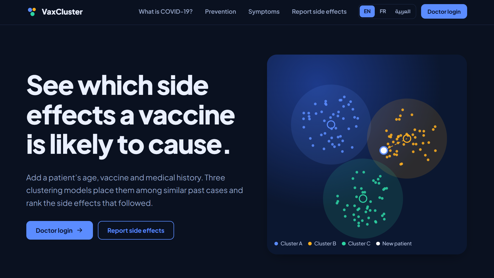
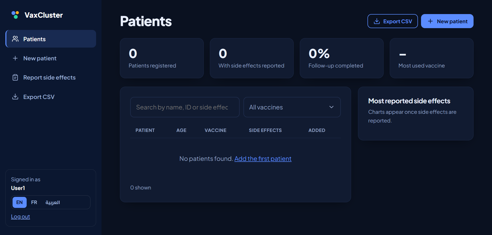
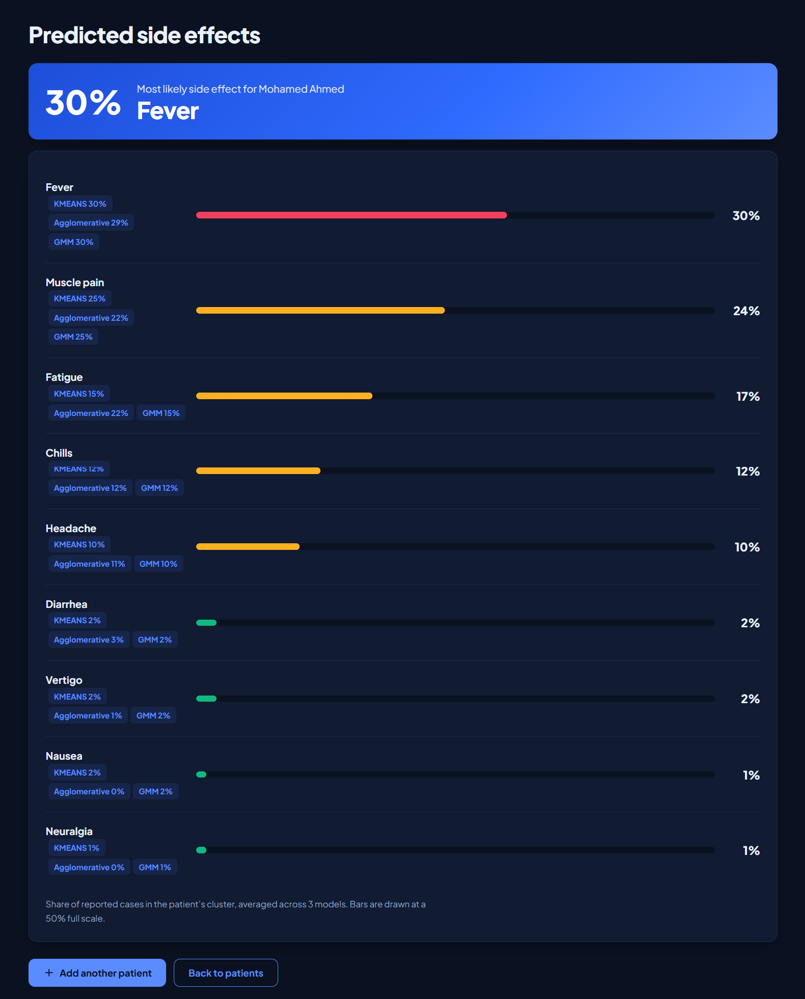

# VaxCluster

**Predicting COVID-19 vaccine side effects with unsupervised clustering.**

VaxCluster is a trilingual (English / Français / العربية) PHP web application that lets healthcare staff record patients and their vaccination details, then estimates the side effects each patient is most likely to experience. Three clustering models (K-Means, Gaussian Mixture, Agglomerative) each assign the patient to a cluster, and the app shows the averaged result along with each model's own view.

This is a Master's thesis project from the Computer Science Department of Badji Mokhtar University, Annaba (LRI laboratory), built on vaccination data collected from patients in Annaba.

## Screenshots

**Home page**: three-cluster visual and a three-step overview




**Doctor dashboard**, **new patient form** (multi-step: patient, vaccination, medical history) and the confirmation page with a *Predict side effects* button



**Prediction results**: ranked side effects, averaged across the three models, with each model's own score




## Features

- **Doctor login** with a protected dashboard (plain-text and hashed passwords are both supported)
- **Patient management**: add, list, search/filter, and view patient details
- **Public side-effect report form** for vaccinated people
- **Prediction from three models**: K-Means, Gaussian Mixture Model (GMM), and Agglomerative Clustering, combined into a ranked list of likely side effects
- **CSV export** of patient data (UTF-8 with BOM, so Arabic and accents open correctly in Excel)
- **Multilingual UI**: EN / FR / AR, with full right-to-left layout for Arabic; the choice is remembered
- **Modern UI**: light/dark theme, custom date/time pickers, animated cluster visual on the home page
- **Security basics**: CSRF tokens on all forms, prepared statements, escaped output, login required for predictions

## How it works

1. A doctor enters a patient's age, sex, vaccine name, vaccination site, season, and medical history.
2. `predicts.php` sends this data as JSON to each Python script in `predictions/` through standard input.
3. Each script loads its pre-trained model (`.pkl`), encodes the input, finds the patient's cluster, and returns the side-effect counts observed in that cluster.
4. The results are normalised per model, averaged, and displayed as a ranked list on the results page.

## Tech stack

| Layer | Technology |
|---|---|
| Backend | PHP 8, MySQL / MariaDB (PDO + MySQLi) |
| ML | Python 3, scikit-learn, NumPy, pandas, SciPy |
| Frontend | Vanilla JavaScript, custom CSS (no framework) |
| Local server | XAMPP (Apache + MySQL) |

## Project structure

```
covid-prediction/
├── index.php                 # Public landing page
├── doctors_login.php         # Login page (login_action.php, logout.php)
├── patients_list.php         # Dashboard: patient list with search/filter
├── add_patient.php           # New patient form
├── patient_details.php       # Single patient view
├── predicts.php              # Runs the Python models
├── prediction_results.php    # Displays predictions
├── patient_form.php          # Public side-effect report form
├── export_csv.php            # CSV export
├── assets/                   # CSS and JavaScript (ui.js, cluster.js, app.js)
├── includes/                 # bootstrap.php (layout, CSRF, helpers), lang.php (translations)
├── configuration/            # app.php (Python path), db.php, db_connection.php
├── predictions/              # Python prediction scripts + Models/*.pkl (used by the app)
├── models/                   # Older copy of the prediction scripts (unused)
├── db sql/covid.sql          # Database schema and sample data
└── images/
```

## Getting started

### Prerequisites

- [XAMPP](https://www.apachefriends.org/) (or any Apache + PHP 8 + MySQL/MariaDB stack)
- Python 3.9+ with the following packages:

```bash
pip install numpy pandas scikit-learn scipy
```

> The `.pkl` models were pickled with a specific scikit-learn version. If loading fails, install the same version used for training.

### Installation

1. **Clone the repository** into your web root (`htdocs` for XAMPP):

   ```bash
   git clone https://github.com/<your-username>/<repo-name>.git
   ```

2. **Create the database.** In phpMyAdmin, create a database named `Covid`, then import `db sql/covid.sql`.

3. **Check the database credentials** in `configuration/db.php` and `configuration/db_connection.php` (defaults: host `localhost`, user `root`, empty password, database `Covid`).

4. **Set the Python path.** Either set the `PYTHON_PATH` environment variable, or edit `configuration/app.php`:

   ```php
   // Windows: 'C:/ProgramData/anaconda3/python.exe'   Linux/macOS: 'python3'
   define('PYTHON_PATH', getenv('PYTHON_PATH') ?: 'python3');
   ```

5. **Open the app** at `http://localhost/<folder-name>/index.php`.

### Demo accounts

The SQL file includes sample doctor accounts for testing:

| Username | Password |
|---|---|
| `User1` | `password123` |
| `User2` | `abc123` |
| `User3` | `qwerty` |

**Change or remove these before any real deployment**, and never use the default empty MySQL root password outside local development.

## Languages

Switch between EN / FR / العربية from the top bar. To add or edit a string, add a line to `includes/lang.php`:

```php
'key' => ['English', 'Français', 'العربية'],
```

then use `t('key')` in the page. Values stored in the database (for example "Fievre") are never changed; only their display name is translated.

## Database

The schema covers patients, vaccinations, side effects, chronic conditions, and the link tables between them (`patient`, `vaccination`, `patient_vaccination`, `effet_secondaire`, `vaccination_effet_secondaire`, `maladie_chronique`, `patient_maladie_chronique`), plus a `users` table for doctor accounts.

## Disclaimer

VaxCluster is an academic / research project. Its predictions are statistical estimates based on clusters of past patient data and **are not medical advice or a diagnostic tool**. Any real-world use must involve qualified healthcare professionals.

## Author

**Abdeldjalil Halisse**: AI Engineer, Master's in Artificial Intelligence and Information Processing, Université Badji Mokhtar, Annaba.

## License

MIT License

Copyright (c) 2026 Abdeldjalil Halisse

Permission is hereby granted, free of charge, to any person obtaining a copy
of this software and associated documentation files (the "Software"), to deal
in the Software without restriction, including without limitation the rights
to use, copy, modify, merge, publish, distribute, sublicense, and/or sell
copies of the Software, and to permit persons to whom the Software is
furnished to do so, subject to the following conditions:

The above copyright notice and this permission notice shall be included in all
copies or substantial portions of the Software.

THE SOFTWARE IS PROVIDED "AS IS", WITHOUT WARRANTY OF ANY KIND, EXPRESS OR
IMPLIED, INCLUDING BUT NOT LIMITED TO THE WARRANTIES OF MERCHANTABILITY,
FITNESS FOR A PARTICULAR PURPOSE AND NONINFRINGEMENT. IN NO EVENT SHALL THE
AUTHORS OR COPYRIGHT HOLDERS BE LIABLE FOR ANY CLAIM, DAMAGES OR OTHER
LIABILITY, WHETHER IN AN ACTION OF CONTRACT, TORT OR OTHERWISE, ARISING FROM,
OUT OF OR IN CONNECTION WITH THE SOFTWARE OR THE USE OR OTHER DEALINGS IN THE
SOFTWARE.
